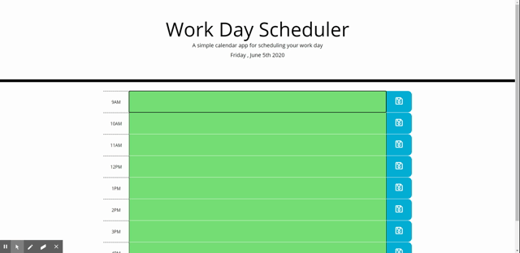

# Work Day Hourly Planner
Link to deployed application here: 

## Description
A simple daily planner for an average work day. Tasks can be entered into the text areas and saved with the corresponding save button, and they will be saved to local memory. Once tasks are cleared out and the save button is clicked again the local storage is updated to reflect the changes. Throughout the day the background of the text area will eb updated dynamically, the text fields of hours in the future will be green, the current hour will be red, and any hours that have passed will be gray. The user will not be required to refresh the page for the changes to take effect. 

## Demo

